# Colour Match

Welcome to the Colour Match website! 

Colour Match is an interactive game where users have to repeat back a colour pattern that gets progressively harder with each turn, inspired by the classic game 'Simon Says'. The goals of the site are:

**Site Owner**

- To provide a fun interactive game that is accessible to all age ranges for the purposes of online entertainment.
- To provide a game that is simple to pick up but still capable of providing a challenge. 

**Site Users**

- To play an online game that is fun and entertaining.
- To play an online game that is quick and easy to engage with.

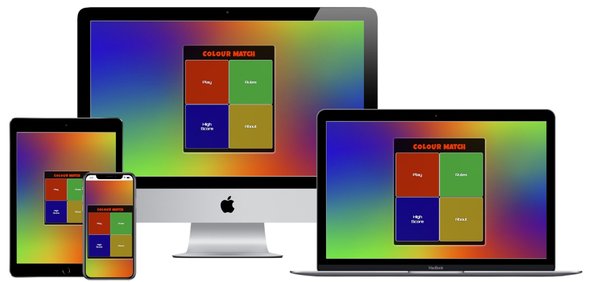

## Live Site

The live site can be found [here](https://adamhatton.github.io/pp2-colour-match/).

Screenshots of the two main sections can be seen below:

Game Menu

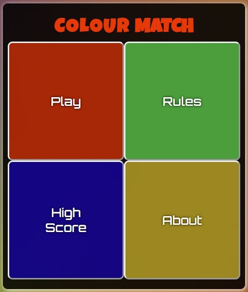

Game Area

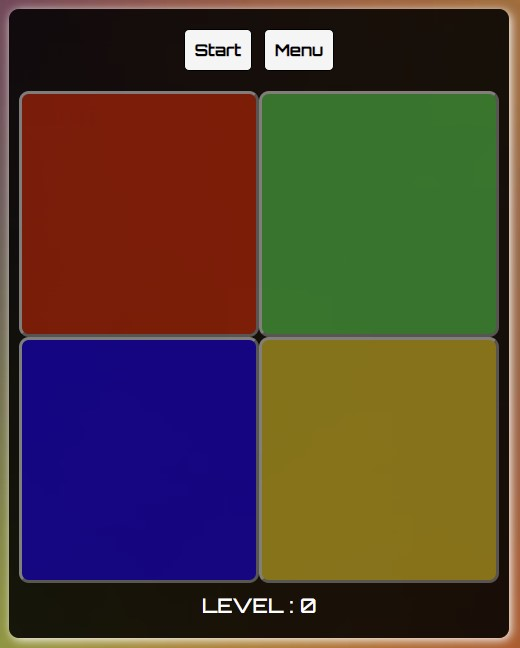

## Table of Contents
- [Features](<#features>)
	- [Existing Features](<#existing-features>)
		- [Game Menu](<#game-menu>)
		- [Game Logo](<#game-logo>)
		- [Game Area](<#game-area>)
		- [Navigation Buttons](<#navigation-buttons>)
		- [Game Over Pop-up](<#game-over-pop-up>)
		- [Rules Pop-up](<#rules-pop-up>)
		- [High Score Pop-up](<#high-score-pop-up>)
		- [About Pop-up](<#about-pop-up>)
	- [Future Features](<#future-features>)
- [User Experience](<#user-experience>)
	- [User Stories](<#user-stories>)
	- [Design](<#design>)
		- [Colours](<#colours>)
		- [Typography](<#typography>)
		- [Imagery](<#imagery>)
		- [Wireframes](<#wireframes>)
- [Technologies](<#technologies>)
	- [Development Technologies](<#development-technologies>)
	- [Testing Technologies](<#testing-technologies>)
- [Testing](<#testing>)
	- [User Stories Testing](<#user-stories-testing>)
	- [Validation and Manual Testing](<#validation-and-manual-testing>)
		- [Validation](<#validation>)
		- [Manual Testing](<#manual-testing>)
- [Bugs](<#bugs>)
- [Deployment](<#deployment>)
- [Forking](<#forking>)
- [Credits and Resources](<#credits-and-resources>)
	- [Code](<#code>)
	- [Content](<#content>)
	- [Media](<#media>)
	- [Acknowledgements](<#acknowledgements>)

## Features

In this section I will describe each of the features of the website and their value. How the features meet the needs of the user stories is also explored in the [testing section](<#testing>).

### Existing Features

#### Game Menu

- The Game Menu is the landing page for the user, it is a clean and simple layout displaying the game's title logo and 4 large buttons for navigating to different sections, making it immediately obvious what options are available to the user
- Each button has a hover effect to provide feedback to the user that it is interactive
- The buttons are clearly and simply labelled to direct the user; they either take the user to the game area or open a popup with more information
- The layout is responsive to different screen sizes, so that the layout changes to 1x4 on screens with smaller heights

#### Game Logo

- The Game Logo is written in a block-style text which has friendly feel
- When clicked, the logo changes colour. This is not advertised to the user, but is explained in one of the game-over messages [(see game over pop-up)](<#game-over-pop-up>), so acts as a type of 'easter egg'
- The 'hidden' interaction provides a fun and interesting moment for the user, as well as a sense of achievement if they find it without needing to be prompted by the game-over message

#### Game Area

- The Game Area is opened when the user selects 'Play'. It consists of 2 navigation buttons, 4 coloured buttons and a score counter
- It follows the same layout as the Game Menu to keep a consistent image for the game
- When opening the Game Area, animation is used to provide a transition between the 2 areas in order to let the user know they are moving to a different part of the application
- As with the Game Menu, the layout is responsive to different screen sizes
- When clicked, each button will light up and play a sound. This is the case even when the game has not started, so the user is not limited to interaction with the game only whilst it is running.
This also helps to provide the user with an immediate indication of how to interact with the game once they start it.
- The Game Area is where the game is played. When started, the user will be shown a pattern in the form of the different coloured buttons lighting up. Each colour will also play a sound when it lights up to enhance the interactive aspect.
Once the pattern is finished, the user can repeat it by pressing the coloured buttons.

#### Navigation Buttons

- The 'Start' and 'Menu' buttons are designed with a clean and simple aesthetic, making them clearly visible and their purpose immediately obvious to the user
- In addition, they both have hover effects and click effects to provide the user with feedback that the buttons do something
- The 'Start' button begins the game by triggering a pattern sequence, and becomes disabled until the pattern has finished playing (to prevent users accidentally starting the game more than once)
- The 'Menu' button takes users back to the Game Menu, and this remains active at all times. This means the user can navigate back to the Menu whenever they want to so they don't feel trapped in the Game Area at any point

#### Score Counter

- The Score Counter sits at the bottom of Game Area to provide a constant source of feedback to the user
- It is initially set to 0, and updates after each round that the user inputs the correct pattern, helping the user to keep track of how well they are doing

#### Game Over Pop-up

- The Game Over Pop-up is triggered when the user incorrectly inputs the pattern
- It contains a title in the same font as the logo to make its purpose immediately clear, along with a lighthearted message to provide some encouragement/entertainment to the user
- The message in the pop-up is chosen randomly from an array of 5 options, providing some variety to the user experience
- The pop-up includes the user's score, so they can see how well they did
- It also includes a close button, which has a hover effect as well as changing the cursor to a pointer to provide feedback to the user that it is interactive

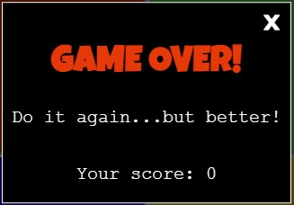

#### Rules Pop-up

- The Rules Pop-up is opened when the user selects 'Rules' from the Game Menu
- It contains a title in the same font as the logo to make its purpose immediately clear, along with a short and simple list of rules
- The rules section is kept separate from the game, so the user is not forced to read them if they think they'll be able to pick up the game intuitively
- As with the other pop-ups, there is an interactive close button

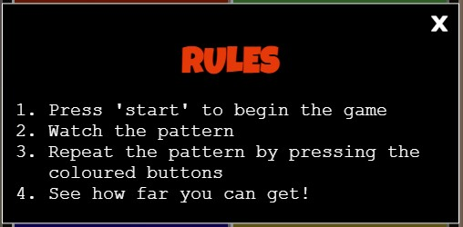

#### High Score Pop-up

- The High Score Pop-up is opened when the user selects 'High Score' from the Game Menu
- It contains a title in the same font as the logo to make its purpose immediately clear, along with a short message showing the user's high score
- This section provides a point of reference for the user to see their best score in case they forget
- As with the other pop-ups, there is an interactive close button

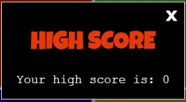

#### About Pop-up

- The About Pop-up is opened when the user selects 'About' from the Game Menu
- It contains a title in the same font as the logo to make its purpose immediately clear, along with a short message about the creator
- As with the other pop-ups, there is an interactive close button

### Future Features

- 'Sound off' feature: Not all users will want to have the sound on nor find it useful in the game. As such a mute function would be useful so that users can turn the sound off if they want to
- Difficulty feature: The game currently only has 1 mode of difficulty. To provide a more versatile experience for the user, a function for increasing or decreasing the difficulty would be useful. This could be done by increasing or decreasing the speed at which the pattern plays.

## User Experience

### User Stories

The target audience of the website is people who are looking to play a simple but entertaining online game, so the site has been designed on the basis of the following user stories:

- As a user I want to easily understand the purpose of the website
- As a user I want navigation and interaction to be intuitive and easy to pick up
- As a user I want to be able to exit the game at any point
- As a user I want to be able to keep track of how well I am doing at the game
- As a user I want the website to be responsive to the device I am using it on

### Design

#### Colours

The below colours have been used throughout the website:

The palette was chosen due to it's simplicity; the colours are bold and bright in order to provide a fun and friendly aesthetic, but they also contrast well with each other to create the main purpose of the game: recognising a pattern.

Black and white (#000 and #fff) have been used for backgrounds and text respectively, again due to the sharp contrast they provide. This ensures that text is clear and easily readable and does not detract from the main purpose of playing the game.

#### Typography

The logo and headings use the font Luckiest Guy with a fall-back of Orbitron and then monospace. Luckiest Guy was chosen as it has a fun and playful feel which make it clear that the content of the website is supposed to be fun. Its block-like lettering also helps to punctuate the different sections clearly.
The text in buttons and the score counter uses the font Orbitron with a fall back of courier and then monospace. Orbitron was chosen as it has a sleek form without looking too 'corporate', allowing the buttons to be clearly labelled without being to visually noisy. 
All other text uses the font Courier with a fall back of monospace. This font was chosen as it is very well recognised and is easy to read.
'Luckiest Guy' and 'Orbitron' were imported from [Google Fonts](https://fonts.google.com/).

#### Imagery

The website uses a single image. This is background image of varying gradients between the 4 main colours. It was used to fit in with the theme of 'colour' without being distracting from the game.

#### Wireframes

Mobile Wireframes

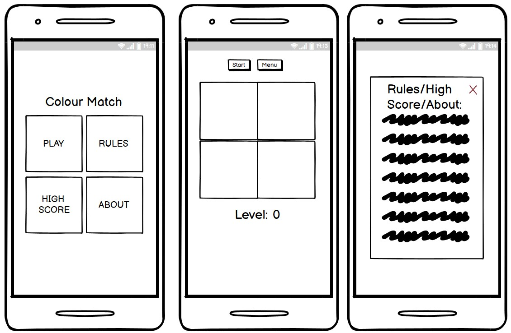

Desktop Wireframes

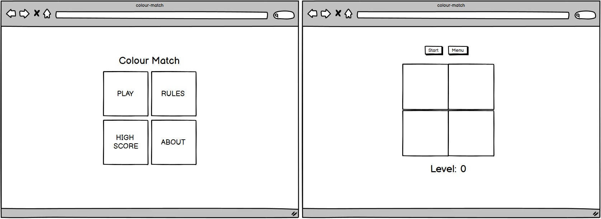

## Technologies

### Development Technologies

**Languages**
- [HTML5](https://en.wikipedia.org/wiki/HTML5) - used to write the structure of the site
- [CSS](https://en.wikipedia.org/wiki/CSS) - used for the styling of the site
- [JavaScript](https://en.wikipedia.org/wiki/JavaScript) - used to write the interactive functionality of the site

**Frameworks, Libraries and Tools**
- [Google Fonts](https://fonts.google.com/) - used to import both Luckiest Guy and Orbitron which are the fonts used throughout the entire site
- [Gitpod](https://www.gitpod.io/) - used to write and develop the website
- [Git](https://git-scm.com/) – used for version controlling by using the Gitpod terminal to commit to Git, and subsequently pushing to GitHub
- [GitHub](https://github.com/) – used to store the source code for the website
- [GitHub pages](https://pages.github.com/) – used to deploy the live site
- [Balsamiq](https://balsamiq.com/) - used to create the initial wireframes of the website
- [Chrome DevTools](https://developer.chrome.com/docs/devtools/) - used throughout the process for testing the responsiveness of the website, debugging issues, experimenting with layout/style choices, and debugging JavaScript issues
- [Cloudconvert](https://cloudconvert.com/) - used to convert the background image to .webp format
- [Techsini](http://techsini.com/multi-mockup/) - used to generate a multi-device mockup (as seen at the beginning of the README)
- [Hex2RGBA](http://hex2rgba.devoth.com/) - used for converting Hex codes to rgba format
- [Favicon](https://favicon.io/favicon-generator/) - used for creating a favicon for the site
- [Coolors](https://coolors.co/) - used for helping to generate a colour scheme

### Testing Technologies

- [a11y Contrast Checker](https://color.a11y.com/) - used for checking contrast accessibility
- [WAVE Web Accessibility Evaluation Tool](https://wave.webaim.org/) - used for checking web accessibility
- [Jigsaw CSS validator](https://jigsaw.w3.org/css-validator/) - used for validating the CSS stylesheet
- [W3C HTML validator](https://validator.w3.org/) - used for validating the HTML markup
- [Lighthouse](https://developers.google.com/web/tools/lighthouse) - used for analysing the performance, accessibility, best practices and SEO of the website
- [JSHint](https://jshint.com/) - used for validating the JavaScript code

## Testing

### User Stories Testing

**As a user I want to easily understand the purpose of the website**
- On the landing page, the user is presented with large buttons labelled "Play", "Rules" and "High Score", making it immediately clear that it is a game ([see game menu](<#game-menu>))
- The user is able to select the "Rules" button to be presented with a short list of rules that explain how the game works (see [game menu](<#game-menu>) and [rules pop-up](<#rules-pop-up>))

**As a user I want navigation and interaction to be intuitive and easy to pick up**
- The buttons on the Game Menu page are clearly labelled with their purpose and are in line with options that a user would expect to see in a game ([see game menu](<#game-menu>))
- All buttons provide feedback to the user that they perform an action through the use of hover and onclick effects
- When a pop-up is used, the game can still be seen in the background to make sure the user knows they can easily get back to it
- The screens have a minimalist design which is consistent throughout so that the user does not get lost ([see game menu](<#game-menu>)) and ([see game area](<#game-area>))

**As a user I want to be able to exit the game at any point**
- When playing the game, the user is able to return to the menu at any point, including whilst an animation is playing. This will stop the game and reset the variables so that they do not feel trapped

**As a user I want to be able to keep track of how well I am doing at the game**
- When playing the game there is a level counter which displays the level that the user is on ([see score counter](<#score-counter>))
- When a game is finished the user is presented with a popup which shows them their score for that particular game ([see game over pop-up](<#game-over-pop-up>))
- There is a highscore button on the Game Menu which allows a user to see their best score so far ([see game menu](<#game-menu>)) and ([see high score pop-up](<#high-score-pop-up>))

**As a user I want the website to be responsive to the device I am using it on**
- Due to the simple design, the game displays consistently across all devices
- Media queries have been used to change the layout from a 2x2 grid to a 1x4 grid when screen height drops below a certain value

### Validation and Manual Testing

#### Validation

**HTML**

- The website was run through the [W3C HTML validator](https://validator.w3.org/). No errors were found (see below screenshot).

HTML Validation

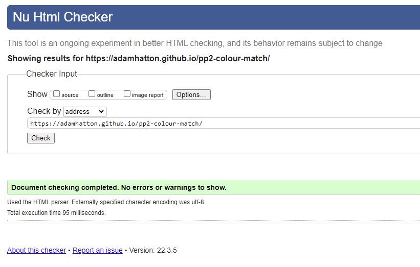

**CSS**

- The website was run through the [Jigsaw CSS validator](https://jigsaw.w3.org/css-validator/). No errors were found (see below screenshot).

CSS Validation

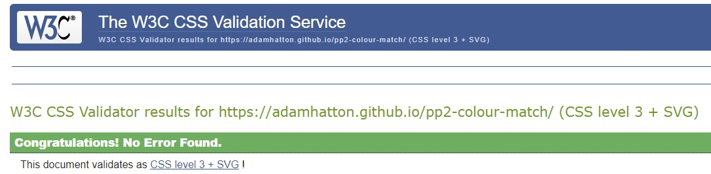

**JavaScript**
- The JavaScript code was run through [JSHint](https://jshint.com/) configured to 'assume new JavaScript features (ES6)'. This produced no errors, but did produce the following warning in 2 places: "Functions declared within loops referencing an outer scoped variable may lead to confusing semantics. (colour, playSound)".
Due to the complexity of the function involved, I decided to leave this and instead rely on the function comments to clarify:

JavaScript Validation

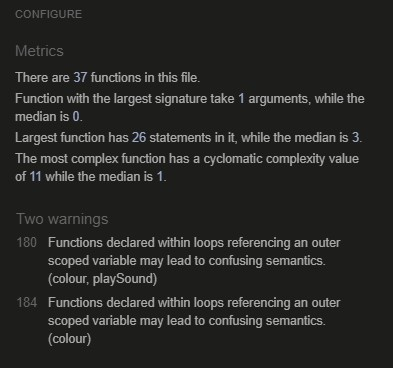

**Accessibility**
- The website was run through the [WAVE Web Accessibility Evaluation Tool](https://wave.webaim.org/). No errors were highlighted (see below screenshot), however 4 alerts were produced relating to the audio elements on the page. To resolve these alerts a transcript would be needed, however the sounds in question
are simply sound effects and it does not impact the playability of the game in anyway if they do not play. As such, these alerts were ignored.

WAVE Validation

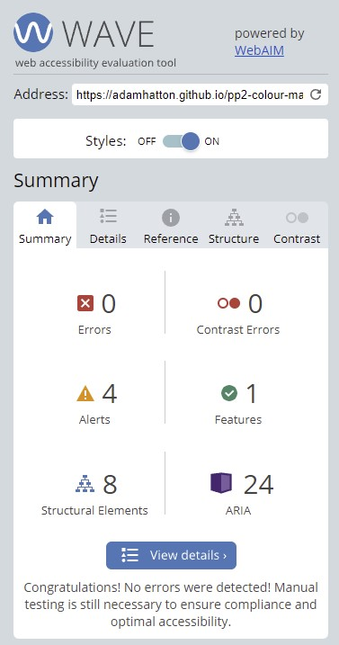

WAVE Alerts

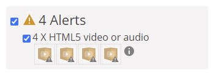

In addition, because the WAVE tool does not check contrast on elements that use opacity, the site was run through the [a11y Contrast Checker](https://color.a11y.com/). This initally produced 2 errors due to white text on the Game Menu buttons not having a high enough contrast against the green and yellow buttons.
To resolve this, I increased the size of the text within the buttons to make it more visible. This also meant that it is treated as large text in terms of the accessiblity guidelines and thus requires a lower contrast ratio. The results can be seen below, but it is worth noting that the text also uses a black text
shadow which increases the contrast ratio, but this is not picked up by automated testing tools:

A11y Validation

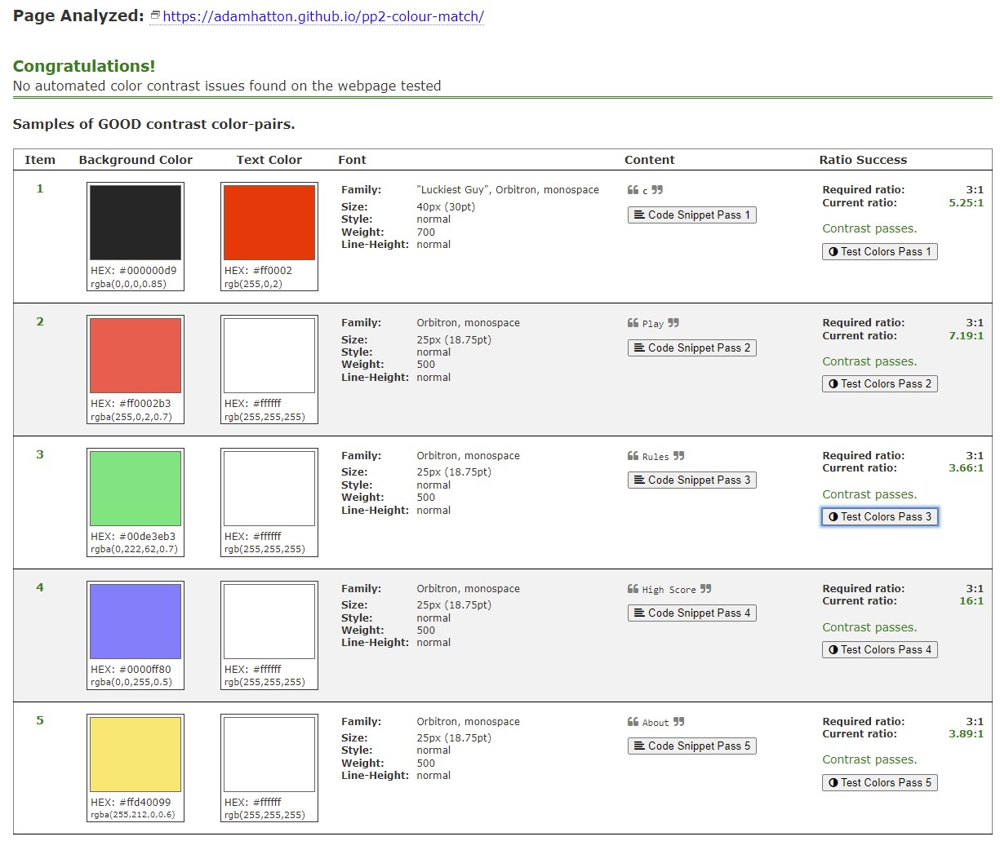

**Lighthouse**
- Each page of the website was run through [Lighthouse](https://developers.google.com/web/tools/lighthouse) to analyse the performance, accessibility, best practices and SEO of the site. Initially the accessibility score was 89 due to the following errors:

Lighthouse Test

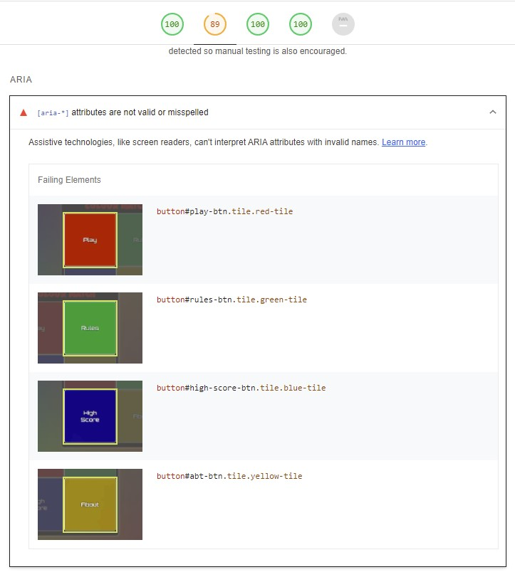

Upon inspection of my html code I determined that this was due to the use of the 'aria-description' property which is not valid. I removed this and decided to rely on the 'aria-labelledby' for my buttons instead. After rerunning Lighthouse, my site achieved 100 for all scores on desktop and 99+ for all scores on mobile:

Lighthouse Desktop

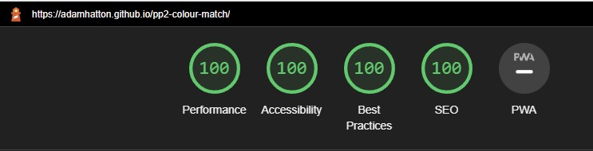

Lighthouse Mobile

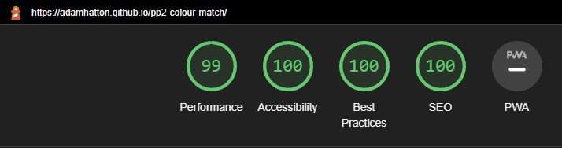

#### Manual Testing

The following tests were made on a desktop using 3 separate browsers: Chrome, Edge and Firefox. The checks were also replicated on a Samsung Galaxy s21 (apart from checking hover over effects):
- Play button hides Game Menu and shows Game Area
- Game Area animation works smoothly
- Rules, High Score and About buttons all show the relevant popup
- Hover over effects of Game Menu buttons work
- Logo changes colour when clicked
- Close button on every popup works
- High score content updates when user gets a new high score
- Start and Menu button hover over and click effects work
- Start button begins the game by showing the first sequence
- Game Area buttons play a sound when pressed
- The user is able to rapidly press the coloured buttons and have a sound trigger each time
- When the sequence is being shown, each button lights up and plays a sound
- When the sequence repeats a colour, the sound effects play correctly
- The score indicator updates after every round the player gets correct
- If the player's input is correct, the next round is triggered (and the sequence is increased by 1)
- If the player's input is incorrect, the game over screen is shown
- The game over screen displays the player's score
- The game over screen cycles through the game over message array
- The Start button and coloured buttons are disabled when the animation is playing
- The menu button returns the player to the menu at any point, even whilst the animation is playing
- Game interface responds to different sized screens and orientations

## Bugs
**Firefox Sound bug**

When testing the game on Firefox, I encountered an issue whereby the sound files sounded distorted and although they could be played rapidly it did not provide as smooth an experience as on other browsers.
To fix this I changed the audio files from .mp3 to .ogg. For example, where the sounds were previously:
~~~
const redSound1 = new Audio('assets/sounds/red-sound.mp3');
const redSound2 = new Audio('assets/sounds/red-sound.mp3');
~~~
I changed these to:
~~~
const redSound1 = new Audio('assets/sounds/red-sound.ogg');
const redSound2 = new Audio('assets/sounds/red-sound.ogg');
~~~
After restesting, this produced a much better experience on Firefox and did not impact the playback on other browsers.

**Repeat Sound Not Playing**

During development I found a bug that when the animation was being shown and a colour was repeated, the sound would not repeat correctly (due to the length of the audio file).
Initially, I was playing the sound by just calling play() on the element:
~~~
document.getElementById(`${colour}-sound`).play();
~~~
In order to fix this bug I researched how to play overlapping sounds and found that I needed multiple audio objects containing the same sound.
I created 2 versions of each sound and added these to an array containing all my sounds. I then created 2 variables to be used when playing the sound which would be assigned values from the sounds array. These were set so that when one sound is being played and the button is pressed again, the original sound gets paused and the second version of the sound is played, as below:
~~~
            if (button.getAttribute('data-colour') === 'red') {
                sound1 = sounds[0];
                sound2 = sounds[1];
            } else if (button.getAttribute('data-colour') === 'green') {
                sound1 = sounds[2];
                sound2 = sounds[3];
            } else if (button.getAttribute('data-colour') === 'blue') {
                sound1 = sounds[4];
                sound2 = sounds[5];
            } else if (button.getAttribute('data-colour') === 'yellow') {
                sound1 = sounds[6];
                sound2 = sounds[7];
            }

            if (sound1.paused && sound2.paused) {
                sound1.play();
            } else if (!sound1.paused && sound2.paused) {
                sound1.pause();  
                sound1.currentTime = 0;              
                sound2.play();
            } else if (sound1.paused && !sound2.paused) {
                sound2.pause();
                sound2.currentTime = 0;    
                sound1.play();            
            }
~~~
This allowed the sound to be played correctly when being repeated in a pattern. In the final version of my code, I refactored this code into a function and renamed the variables to be more descriptive.

**Game Over Bug**

During development I encountered a bug whereby if a user had played a game and then pressed one of the coloured buttons, it triggered the game over screen to show.
The checkPlayerInput() function is called when the buttons are active and the array used for the animation sequence has a length greater than one, and if the input is incorrect the gameOver() function will be called it will show the game over screen.
However, the gameOver() function did not reset the array back to being empty, therefore when clicking the buttons after a game had ended, it was calling checkPlayerInput() unexpectedly.
To fix this issue, I added an additional line to the gameOver() function to set the array to being empty:
~~~
gameSequence = [];
~~~

## Deployment

To deploy the live site, the following steps were taken:

1. Go to github.com
2. Login to my GitHub account
3. Select the repository 'adamhatton/pp2-colour-match' from my repository list
4. Go to the settings within the repository
5. From within settings, select ‘Pages’ from the menu
6. Select the ‘main’ branch from the ‘Source’ dropdown menu
7. Select 'Save'
8. After a short while, the site was published and confirmation of a live link was provided

## Forking

To fork the repository, please follow the below steps:

1. Go to github.com
2. Log into your Github account
3. Use the search function to search for adamhatton/pp2-colour-match to find the repository
4. Select the repository from the results
5. On the repository page select 'Fork' in the top right of the page
6. The repository will be forked to your own Github account

## Credits and Resources

### Code

- I knew that I would be using modals within the interface, so to get a good understanding of how to create these I used [this YouTube tutorial](https://www.youtube.com/watch?v=6ophW7Ask_0) by "Traversy Media"
- When implementing the animation sequence using setTimeout(), I used [this article](https://www.freecodecamp.org/news/thrown-for-a-loop-understanding-for-loops-and-timeouts-in-javascript-558d8255d8a4/) to understand how the function works
- In order to get rid of 'sticky' hover events on mobile devices, I used the solution in [this Stack Overflow post](https://stackoverflow.com/questions/17233804/how-to-prevent-sticky-hover-effects-for-buttons-on-touch-devices) (specifically from user 'cvrebert')
- To prevent the logo text from being highlighted so that the colour change function would work, I discovered the 'userSelect = none' solution from [this Stack Overflow post](https://stackoverflow.com/questions/5429827/how-can-i-prevent-text-element-selection-with-cursor-drag) (specifically from user 'Erkki Teedla')
- To prevent the 'touchstart' event from causing duplicated sounds from playing due to it also calling the 'mousedown' event, I learned that the preventDefault() function could be used to prevent this from [this Stack Overflow post](https://stackoverflow.com/questions/13655919/how-to-bind-both-mousedown-and-touchstart-but-not-respond-to-both-android-jqu) (specifically from user 'Radu C')
- When trying to figure out how to to play the same sound more than once at the same time, I learned that separate audio objects are needed from [this Stack Overflow post](https://stackoverflow.com/questions/38552703/overlapping-sound-i-javascript/38553024) (specifically from user 'Stanislav Lavrov')
- The first time I ran my code through JSHint I received the following warning: 'The body of a for in should be wrapped in an if statement to filter unwanted properties from the prototype.'. In order to understand how to fix this warning, I used [this Stack Overflow post](https://stackoverflow.com/questions/1963102/what-does-the-jslint-error-body-of-a-for-in-should-be-wrapped-in-an-if-statemen)
- The solution for clearing the setTimeouts() when a user navigates back to the menu whilst the animation is playing was provided by Code Institute Support Team. The solution adds all the timeouts to a global object which allows them to be separately cleared using a loop

### Content

- All content was written by Adam Hatton (the developer)

### Media

- The background image was created specifically for this project by my partner, Nichola Leafe

### Acknowledgements

- I'd like to thank my mentor Spencer Barriball for his guidance in the planning stage of the project and feedback on the finished product
- I'd also like to thank my partner Nichola for her constant support and feedback on what I was creating